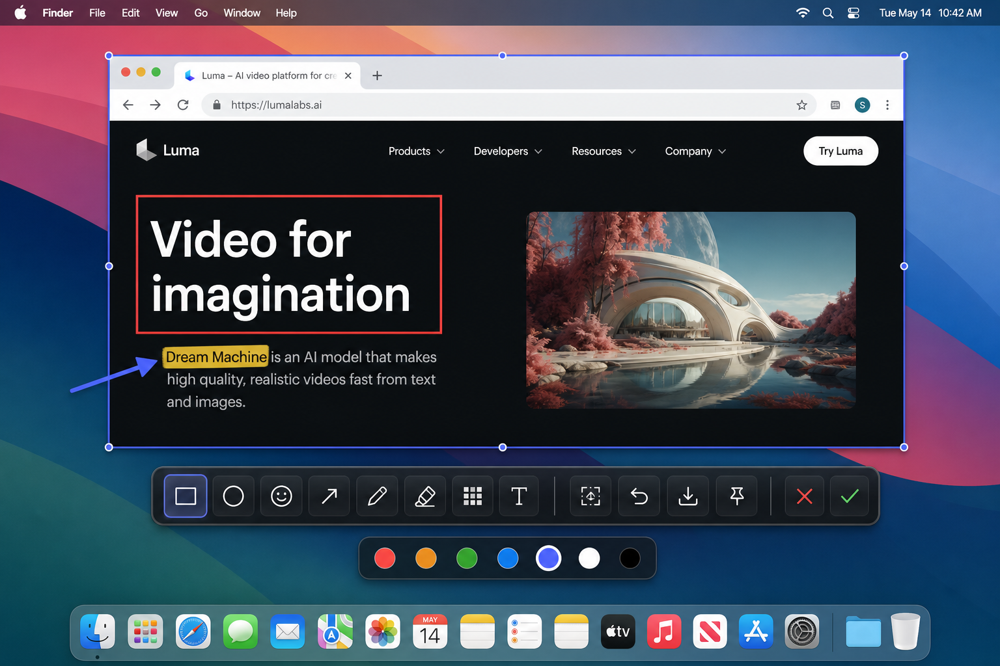

<div align="center">


# LiteSnap

**截图 · 标注 · 贴屏 · 搞定**

轻量快速的截图与标注工具，当前优先发布 Windows 版。macOS 会在 Apple Developer 审核与公证完成后再上线。

[English](./README.md) · **简体中文** · [繁體中文](./README.zh-TW.md)

<br />

[](https://github.com/HuibingLin/LiteSnap/releases/download/v2.0.0/LiteSnap_2.0.0_x64-setup.exe)
[](./LICENSE)
[](#下载)

</div>

---

## 下载

**Windows 先上线。** 目前先发布 Windows 安装包，方便直接给用户下载。macOS 会在 Apple Developer 审核和公证完成后再开放。

最新版：**[v2.0.0](https://github.com/HuibingLin/LiteSnap/releases/tag/v2.0.0)** · [全部版本](https://github.com/HuibingLin/LiteSnap/releases)

| 版本 | Windows | macOS | 说明 |
|:----:|:-------:|:-----:|:-----|
| **v2.0.0** | [LiteSnap_2.0.0_x64-setup.exe](https://github.com/HuibingLin/LiteSnap/releases/download/v2.0.0/LiteSnap_2.0.0_x64-setup.exe) | 稍后上线 | 从 Electron 迁移到 Tauri，安装包更小、启动更轻 |
| v1.0.1 | [LiteSnap-1.0.1-setup.exe](https://github.com/HuibingLin/LiteSnap/releases/download/v1.0.1/LiteSnap-1.0.1-setup.exe) | 即将推出 — 如需 macOS 请[提交 Issue](https://github.com/HuibingLin/LiteSnap/issues) | 旧版公开 Windows 版本 |

> macOS 目前暂停发布，等 Apple Developer 审核完成后再上线。Windows 用户现在可以直接下载新版。

---

## 简介

按下全局快捷键，拖拽框选区域，标注后即可复制、保存或贴到屏幕上——几秒完成。专注日常截图与无缝长截图。

## 预览

<p align="center">
  <br />
  <em>框选区域后可调整大小与位置，再开始标注</em>
</p>

<p align="center">
  <br />
  <em>矩形、画笔、荧光笔、马赛克、文字、表情贴纸等</em>
</p>

<p align="center">
  <br />
  <em>滚动长截图，实时预览拼接进度</em>
</p>

<p align="center">
  <br />
  <em>截图以真实尺寸悬浮置顶，方便对照</em>
</p>

## 功能

- **全局快捷键** — 任意应用中唤起（macOS `⌥A`，Windows `Ctrl+Shift+A`，可自定义）
- **区域可调** — 截图后拖动手柄改大小、拖动内部移动位置
- **标注工具** — 矩形、椭圆、箭头、画笔、荧光笔、马赛克、文字、表情贴纸
- **滚动长截图** — 浏览器 / PDF / 聊天窗口无缝拼接，带实时预览
- **贴在屏幕** — 截图以真实尺寸悬浮置顶
- **托盘常驻** — 不占 Dock / 任务栏；支持英文、简体、繁体

## 为什么是 v2.0.0

- Electron 安装包体积太大，所以 LiteSnap 迁移到 Tauri，降低安装包体积，也让启动更轻。
- Windows 版本先发布，这样可以先把稳定安装包交付给大家下载使用。
- macOS 会稍后上线，因为 Apple Developer 目前还在审核中，签名和公证还没完成。

## 旧版技术栈说明

旧版技术栈：Electron · electron-vite · React 19 · TypeScript · Zustand · electron-builder

新版技术栈：Tauri 2 · Rust · React 19 · TypeScript · Zustand

## 开发

```bash
cd app
npm install
npm run dev
```

### 打包安装包

```bash
cd app
npm run build:win         # → dist/LiteSnap_2.0.0_x64-setup.exe
npm run build:mac         # → dist/LiteSnap-2.0.0-*.dmg（macOS 后续发布）
```

## 许可证

[MIT](./LICENSE) © HuibingLin
